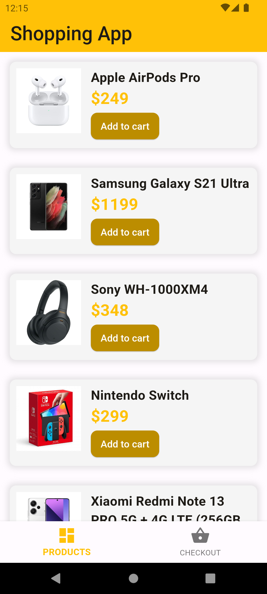
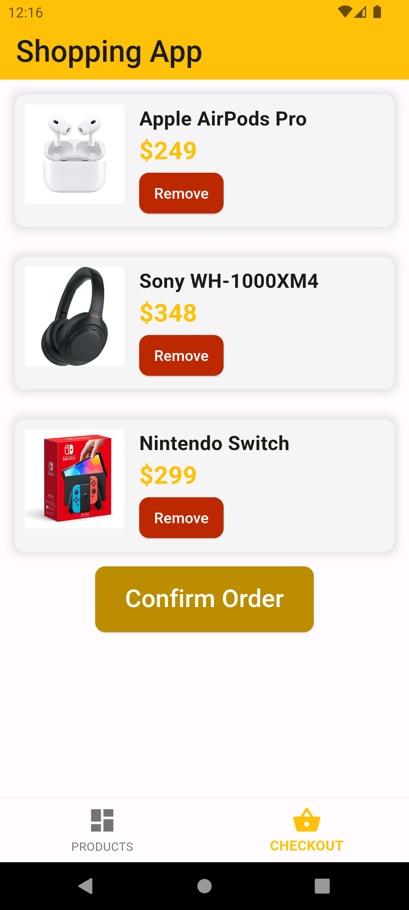

# Simple Shopping App

A simple shopping app built with Flutter as part of the HNG Internship Stage One task. The app features a list of products and a checkout screen with basic functionality.

## Features

- Displays a list of products.
- Allows adding and removing products from the checkout.
- Provides a checkout screen where users can review their selected products.
- Order confirmation screen upon successful checkout.

## Screenshots

### Product List Screen

### Checkout Screen

### Order Successful Screen

## Getting Started

### Prerequisites

- Flutter installed on your machine. [Flutter Installation Guide](https://flutter.dev/docs/get-started/install)

### Installation

1. Clone the repository

   git clone <https://github.com/fidelity2851/shopping_app_hng.git>

   cd shopping_app_hng

   flutter pub get

   flutter run

### Demo

A virtualized demonstration of the app is available on [Appetize.io](https://appetize.io/app/b_yzvfq7irhn2wz5wt64tpwrtziy)

### License

Distributed under the MIT License.
